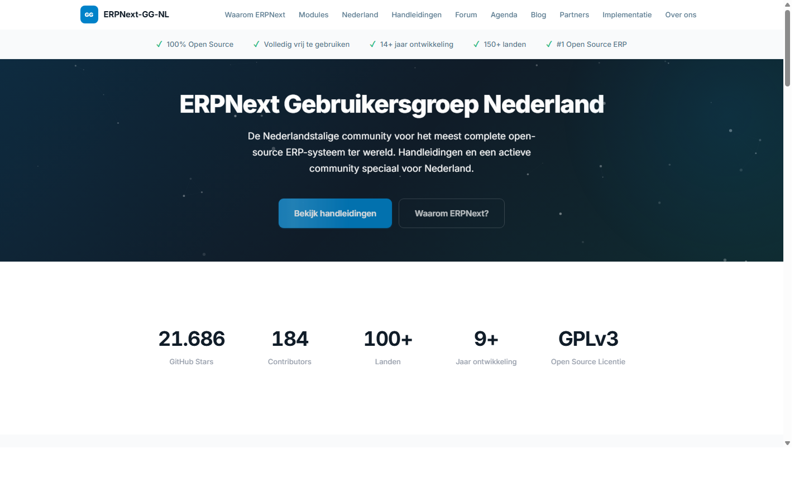
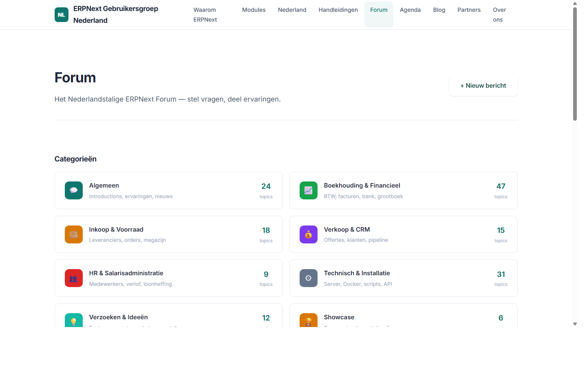
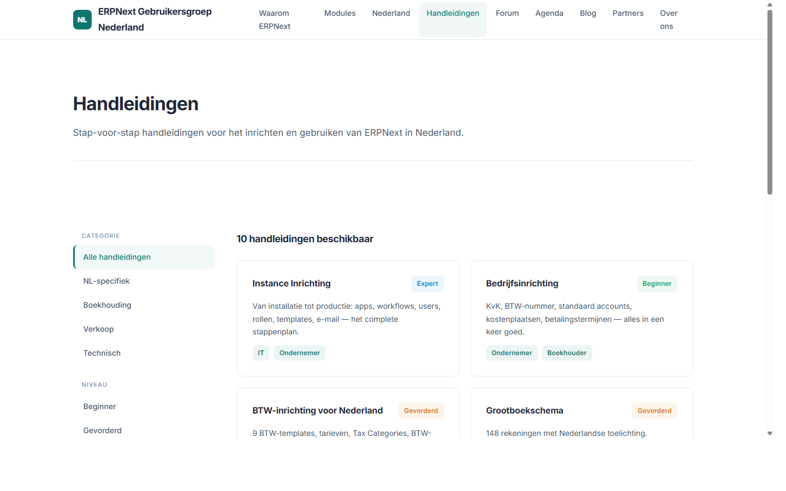
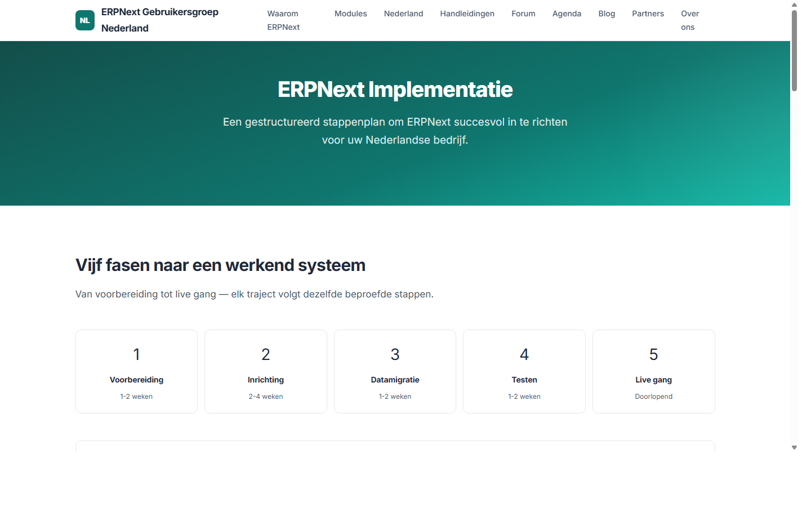
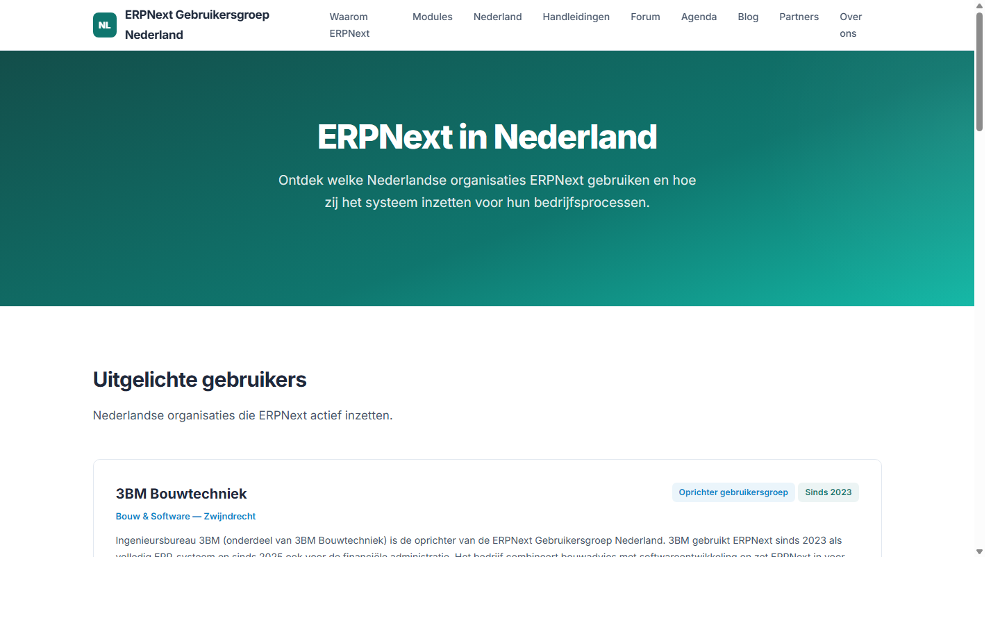
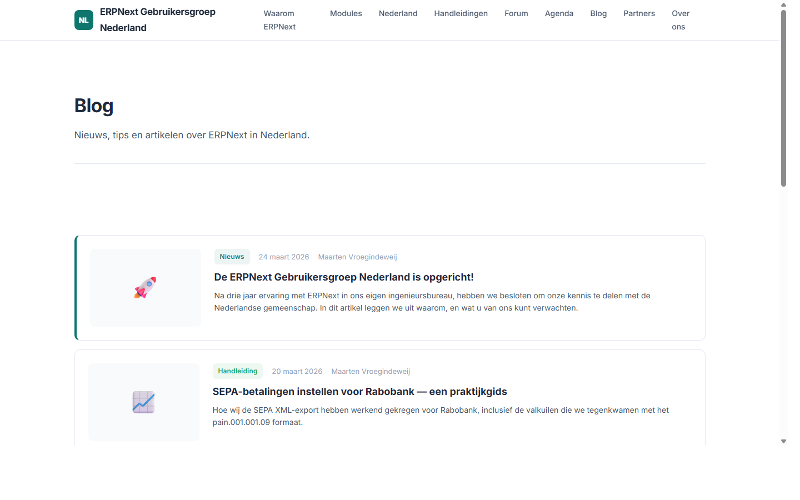

# ERPNext Gebruikersgroep Nederland

De website van de ERPNext Gebruikersgroep Nederland — de Nederlandstalige community voor ERPNext-gebruikers.

## Screenshots

### Homepage


### Forum


### Handleidingen


### Implementatie


### Klanten


### Blog


## Over dit project

Dit is het ontwerp en de mockup voor de website van de ERPNext Gebruikersgroep Nederland. De gebruikersgroep is begin 2026 opgericht door Ingenieursbureau 3BM uit Zwijndrecht.

### Inhoud

```
mockup/              HTML mockup (14 pagina's + single-page SPA)
ontwerp/paginas/     Content in Markdown (11 pagina's)
ontwerp/werkboeken/  Handleidingen in Markdown (10 stuks)
data/                ERPNext API-exports (accounts, BTW, scripts)
```

### Mockup bekijken

Open `mockup/single-page.html` in een browser. Dit is een volledig zelfstandig HTML-bestand met alle pagina's als SPA.

### Pagina's

| Pagina | Inhoud |
|---|---|
| **Home** | Hero, modules, handleidingen, branches, forum preview, agenda |
| **Waarom ERPNext** | USP's, vergelijkingen, community, veelzijdigheid |
| **Modules** | Alle ERPNext-modules met beschrijving |
| **Nederland** | BTW, SEPA, banken, facturatie, compliance, branches |
| **Handleidingen** | 10 stap-voor-stap handleidingen voor NL-administratie |
| **Forum** | Nederlandstalig forum met categorieen en berichten |
| **Agenda** | Evenementen incl. Gebruikersdag 18 sept 2026 Dordrecht |
| **Blog** | Nieuws en artikelen |
| **Implementatie** | Stappenplan voor eenvoudige en uitgebreide implementatie |
| **Klanten** | Nederlandse ERPNext-gebruikers |
| **Partners** | OpenCompany246, PRILK, Impertio Studio, Frappe Cloud |
| **Over ons** | Opgericht door 3BM, missie, DACH als voorbeeld |

### Handleidingen

| Handleiding | Onderwerp |
|---|---|
| Bedrijfsinrichting | Company setup, KvK, standaardwaarden |
| BTW-inrichting | 9 BTW-templates, tarieven, aangifte, scenario's |
| Grootboekschema | 148 rekeningen, Nederlandse structuur |
| Bankkoppelingen | Bankrekeningen, SEPA, creditcard, reconciliatie |
| Payment Order & SEPA | Volledige SEPA-workflow tot Rabobank upload |
| Verkoopworkflow | Quotation tot Sales Invoice |
| Bulk email & herinneringen | Dunning, debiteurenbeheer |
| Bankreconciliatie | MT940/CAMT.053, 8 scenario's |
| Server & Client Scripts | 13 server + 15 client scripts met code |
| Instance Inrichting | Apps, workflows, users, rollen, templates, e-mail |

### Tech stack

- HTML/CSS/JS (vanilla, geen frameworks)
- Inter font (Google Fonts)
- Leaflet.js (kaarten, toekomstig)
- Particle canvas animaties
- Scroll-triggered animaties (IntersectionObserver)
- Ontworpen voor ERPNext/Frappe als uiteindelijk platform

### Links

- [ERPNext](https://erpnext.com)
- [Frappe Framework](https://frappeframework.com)
- [Frappe Cloud](https://frappecloud.com)
- [ERPNext DACH (Duitsland)](https://discuss.erpnext.com/c/erpnext-dach)
- [ERPNext Forum](https://discuss.frappe.io)

---

ERPNext Gebruikersgroep Nederland — Opgericht begin 2026 door [Ingenieursbureau 3BM](https://www.3bm.co.nl)
